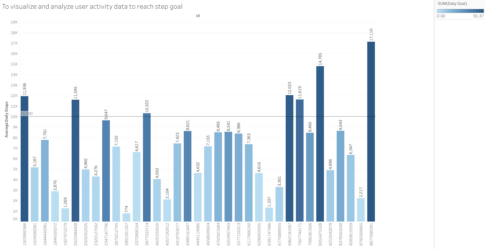
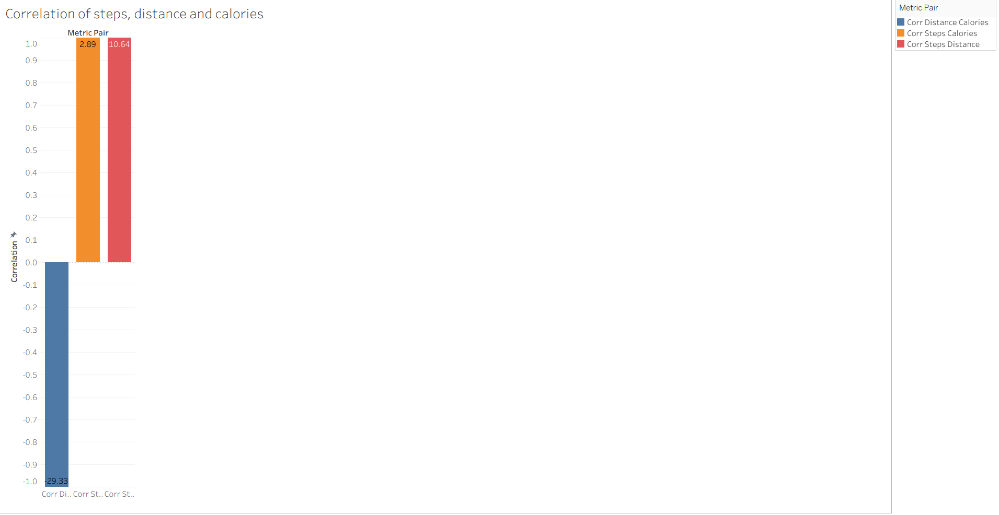
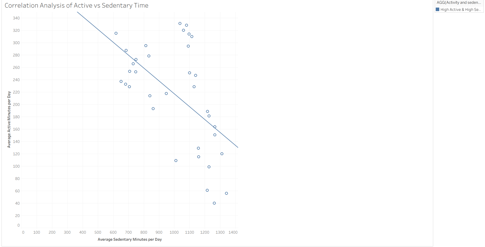
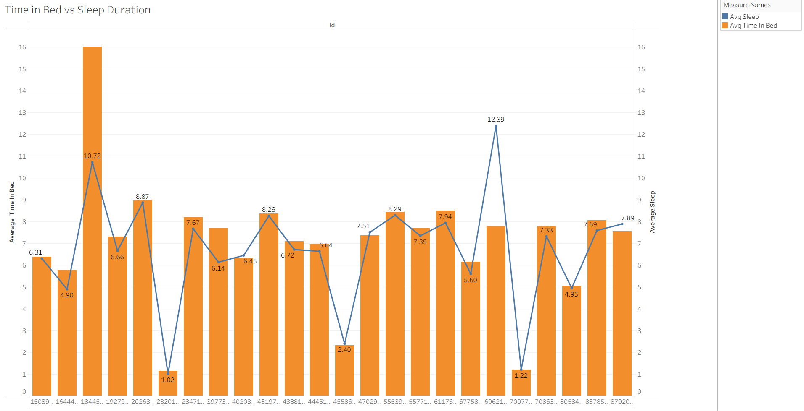
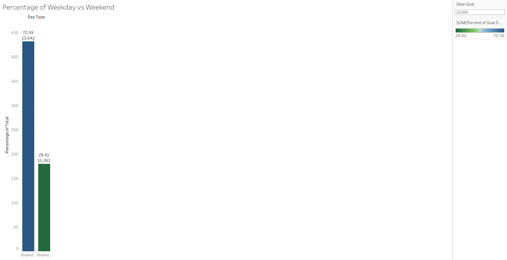
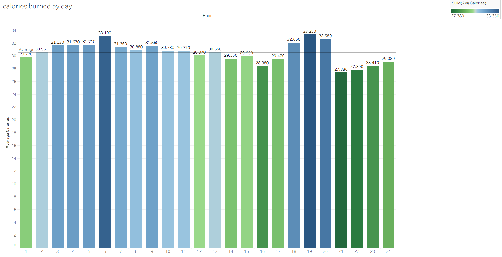
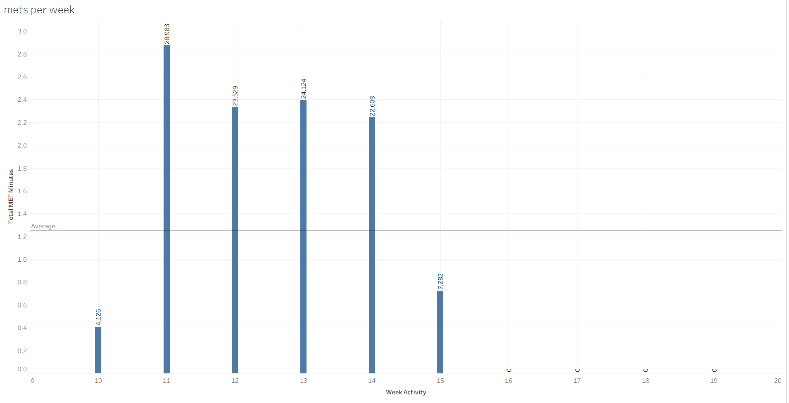

# 📊 Bellabeat Case Study- FitBit Smart Device Data Analysis

## Table of Contents
- Overview
- Dataset
- Tools Used
- Key Insights
- SQL Queries
- Visuals
- Recommendations
- Conclusion
- Limitations
- Credits and Acknowledgement

## 📌 Overview
Bellabeat, a health-focused company, aims to better understand how users engage with their products. This case study analyzes Fitbit smart device data to uncover activity and sleep patterns, providing insights to enhance customer experience and promote healthier habits.

## 📁 Dataset
- Contains daily activity and health data from 30 eligible FitBit users who consented to share their information.
- The dataset spans **March–May 2016** and includes three tables:  
- **Daily Activity**  
- **Hourly Activity** 
- **Minute Activity**  

These were cleaned and merged to analyze consumer smart device usage trends, which can inform Bellabeat’s product and marketing strategy.  
Source: https://www.kaggle.com/datasets/arashnic/fitbit from Kaggle.

## 🛠️ Tools Used
- Excel (for Exploration)
- SQL (for Data Cleaning and Transformation)
- Tableau (for Visualization and Dashboards)

## 📊 Key Insights
**Comparison of average daily steps** : The baseline activity level for users shows that many fall short of the 10,000-step benchmark. This highlights an opportunity for Bellabeat to encourage more daily movement.

**Step Goal** : Comparing daily steps against the 10k reference line reveals that only a portion of users consistently reach the goal. Gamified challenges could motivate better performance.

**Active vs Sedentary Minutes**: Users spending more than 12 hours sedentary per day generally show low active minutes. Prolonged inactivity highlights a need for regular movement breaks.

**Sleep and Sedentary Thresholds** : Balanced sleep (7–9 hrs) aligns with healthier activity, while too little or too much sleep, combined with high sedentary time, suggests risks for long-term health.

**Sleep Patterns** : Some users spend long hours in bed but achieve relatively less sleep, indicating poor sleep quality. This shows the need to focus on sleep efficiency.

**Weekend vs Weekday Activity** : Users tend to log more steps on weekends, suggesting leisure time boosts activity. Weekdays remain a key opportunity to encourage movement.

**Peak Activity Per User** : The most active time of day occurs around 6 PM, aligning with after-work routines. Evenings are ideal for activity reminders or challenges.

**Calories Burned Per Day** : Daily calories burned vary widely between users, reflecting differences in movement and activity levels. Personalized calorie goals could drive healthier habits.

**METs Per Week** : Most users fall short of the recommended 500–1000 MET-minutes weekly, indicating overall underactivity. This reinforces the need for structured exercise routines.

**Weekly Activity minutes by intensity zone** :  Users spend most of their time in light activity and less in moderate-to-vigorous zones. Structured workouts could help improve cardiovascular health.

**Correlation of steps, calories and distance** : Strong positive correlations show that more steps directly translate to more calories burned and longer distances. Encouraging step increases benefits multiple health metrics.

## 🗄️ SQL Queries
### 1. Average Daily Steps
```sql
SELECT Id, AVG(TotalSteps) AS avg_daily_steps FROM affable-hydra-468812-d9.daily_data.dailyactivity
GROUP BY Id
ORDER BY avg_daily_steps DESC; 
```
➡ Shows the average steps per user as a baseline activity level. Most users fall short of the 10,000-step goal, suggesting room for increased daily movement.
### 2. Step Goals
```sql
SELECT Id, COUNTIF(TotalSteps >= 10000) * 100.0 / COUNT(*) AS daily_goal FROM affable-hydra-468812-d9.daily_data.dailyactivity
GROUP BY Id
ORDER BY daily_goal DESC;
```
➡ Compares users’ average steps with a 10k reference line. Many users don’t meet this benchmark, indicating potential for step challenges or motivational features.

### 3. Correlation Between Steps, Calories, and Distance
```sql
SELECT Id, 'steps_vs_calories' AS correlation_type, CORR(TotalSteps, Calories) AS corr_value FROM affable-hydra-468812-d9.daily_data.dailyactivity
GROUP BY Id

UNION ALL

SELECT Id, 'steps_vs_distance' AS correlation_type, CORR(TotalSteps, TotalDistance) AS corr_value FROM affable-hydra-468812-d9.daily_data.dailyactivity
GROUP BY Id 

UNION ALL

SELECT Id, 'calories_vs_distance' AS correlation_type, CORR(Calories, TotalDistance) AS corr_value FROM affable-hydra-468812-d9.daily_data.dailyactivity
GROUP BY Id;
```
➡ Displays correlation values between steps, calories, and distance. Strong positive correlations confirm that higher steps also lead to more calories burned and longer distances

### 4. Active vs. Sedentary Time
```sql
SELECT AVG(SedentaryMinutes) AS avg_sedentary, AVG(VeryActiveMinutes + FairlyActiveMinutes + LightlyActiveMinutes) as avg_active FROM affable-hydra-468812-d9.daily_data.dailyactivity;
```
➡ Scatterplot of active vs. sedentary minutes. Users with long sedentary times show lower activity, highlighting the need for movement breaks during the day.

### 5. Sleep and Sedentary Thresholds
```sql
SELECT Id, ROUND(AVG(TotalSteps), 2) AS avg_steps,
ROUND(AVG(Calories), 2) AS avg_calories,
ROUND(AVG(TotalMinutesAsleep), 2) AS avg_sleep_minutes,
ROUND(AVG(SedentaryMinutes), 2) AS avg_sedentary_minutes,
CASE WHEN AVG(TotalSteps) >= 10000 THEN 'Highly Active'
     WHEN AVG(Totalsteps) BETWEEN 5000 AND 9999 THEN 'Moderately Active'
     else 'Sedentary'
     END AS activity_level,
CASE WHEN AVG(TotalMinutesAsleep) BETWEEN 420 AND 480 THEN 'Good Sleep'
     WHEN AVG(TotalMinutesAsleep) < 420 THEN 'Sleep Deprived'
     ELSE 'Long Sleeper'
     END AS sleep_quality,
CASE WHEN AVG(SedentaryMinutes) > 720 THEN 'High Risk'
    WHEN AVG(SedentaryMinutes) BETWEEN 480 AND 720 THEN 'Moderate Risk'
    ELSE 'Low Risk'
    END AS sedentary_risk
 FROM  affable-hydra-468812-d9.daily_data.dailyactivity
GROUP BY ID;
```
➡ Compares sleep hours with sedentary time. Balanced sleep (7–9 hrs) aligns with healthier activity, while excessive sitting links to higher health risks.

### 6. Sleep Patterns
```sql
SELECT Id,
ROUND(AVG(TotalMinutesAsleep) / 60, 2) AS avg_sleep,
ROUND(AVG(TotalTimeInBed) / 60, 2) AS avg_time_in_bed FROM affable-hydra-468812-d9.daily_data.dailyactivity
GROUP BY Id;
```
➡ Dual-axis chart of time in bed vs. sleep duration. Some users show inefficiency (time in bed but less sleep), pointing to poor sleep quality.

### 7. Weekend vs. Weekday Activity of Users Who Reached The Goal Or Not
```sql
SELECT CASE WHEN EXTRACT(DAYOFWEEK FROM ActivityDate) IN(1,7) THEN 'Weekend'
ELSE 'Weekday'
END AS Day_Type,
COUNT(*) AS Days_Count,
ROUND(AVG(TotalSteps), 2) AS Avg_Steps,
ROUND(COUNT(*) * 100.0 / (SELECT COUNT(*) FROM affable-hydra-468812-d9.daily_data.dailyactivity
WHERE TotalSteps >= 10000), 2) AS Percent_of_Goal_Days FROM affable-hydra-468812-d9.daily_data.dailyactivity
WHERE TotalSteps >= 10000
GROUP BY Day_Type
ORDER BY 
CASE Day_Type
WHEN 'Weekday' THEN 1
WHEN 'Weekend' THEN 2
END;
```
➡ Groups steps by day of the week. Shows whether the people who are reaching the goal daily are also active in weekends or weekdays Activity tends to increase on weekends, suggesting that leisure time boosts movement.

### 8. Peak Activity per User
```sql
SELECT  EXTRACT(HOUR FROM ActivityHour) AS activity_hour,
ROUND(AVG(StepTotal), 2) AS avg_steps FROM affable-hydra-468812-d9.hour_data.hourly_activity
GROUP BY activity_hour
ORDER BY activity_hour;
```
➡Shows peak engagement hours, with the highest activity around 6 PM. This suggests evenings are key times for targeted reminders or app engagement.

### 9. Calories Burned per Day
```sql
SELECT EXTRACT(HOUR FROM ActivityHour) AS hour,
ROUND(AVG(Calories), 2) AS avg_calories FROM affable-hydra-468812-d9.hour_data.hourly_activity
GROUP BY hour
ORDER BY hour
```
➡ Displays total daily calories burned. Variations reflect differences in user activity and can help tailor personalized activity goals.

### 10. METs per Week
```sql
SELECT Id, EXTRACT(WEEK FROM ActivityMinute) AS week_activity, 
SUM(METs) AS weekly_met_minutes,
SUM(METs) / (7*1440) AS mets_per_min_in_week FROM affable-hydra-468812-d9.minute_data.minute_activity
GROUP BY Id, week_activity
ORDER BY mets_per_min_in_week DESC;
```
➡ Summarizes weekly energy expenditure (METs). Most users stay below the 500–1000 MET-minutes recommended for good health, signaling underactivity.

### 11. Weekly Activity Minutes by Intensity Zone
```sql
SELECT Id, DATE(ActivityMinute) AS activity_date,
 1440 - COUNT(*) + SUM(CASE WHEN METs < 3 THEN 1 ELSE 0 END) AS light_minutes,
SUM(CASE WHEN METs BETWEEN 3 AND 6 THEN 1 ELSE 0 END) AS moderate_minutes,
SUM(CASE WHEN METs > 6 THEN 1 ELSE 0 END) AS vigorous_minutes FROM affable-hydra-468812-d9.minute_data.minute_activity
GROUP BY Id, activity_date
ORDER BY activity_date;
```
➡ Breaks activity into light, moderate, and vigorous zones. Many users spend more time in light activity, falling short of moderate-to-vigorous levels recommended by health guidelines.

## 📊 Visuals
Below are some charts created in Tableau:

### Average Daily Steps

Shows the baseline activity level of each user by calculating their average daily steps. Many users fall short of the 10,000-step benchmark, which is widely considered a standard goal for maintaining an active lifestyle. This highlights an opportunity for interventions such as challenges or motivational reminders to encourage higher activity levels.

### Step Goals

This bar chart compares daily step counts against the 10,000-step reference line. The visualization makes it easy to see which users consistently meet or miss the goal. Since many users fall below this threshold, introducing gamification, streak tracking, or step challenges could improve user engagement.  

### Correlation Between Steps, Calories, and Distance

The chart displays correlation coefficients between three metrics: steps, calories burned, and distance traveled. Strong positive correlations confirm that as users walk more steps, they also cover greater distance and burn more calories. This validates Fitbit’s tracking metrics and shows that promoting step goals has a direct link to calorie expenditure.

### Active vs Sedentary Time

This scatterplot compares sedentary minutes (x-axis) with active minutes (y-axis). A negative trend suggests that users who spend more time sitting tend to be less active overall. Prolonged sedentary time (>12 hrs/day) is linked to health risks such as obesity, diabetes, and cardiovascular issues. Encouraging users to take movement breaks could reduce these risks.

### Sleep and Sedentary Thresholds

This chart compares sleep duration with sedentary minutes. Users with balanced sleep (7–9 hrs) tend to align with healthier activity, while excessive sedentary time often overlaps with poor sleep patterns. Sleeping less than 7 hours leads to fatigue and reduced focus, while oversleeping may indicate low activity or underlying health concerns.

### Sleep Patterns

A dual-axis chart comparing average time in bed (line) with actual sleep duration (bars). Some users show a large gap between time in bed and sleep, suggesting inefficient or disturbed sleep. Others show smaller gaps, reflecting more restorative rest. This highlights the importance of promoting sleep quality, not just time spent in bed.

### Weekend vs. Weekday Activity

This chart groups steps by day of the week. Results suggest that many users are more active on weekends, likely due to more leisure time and fewer work constraints. This insight can guide app notifications — for example, motivating weekday activity to balance out sedentary office hours.

### Peak Activity per User

Identifies times of day with the highest engagement. The peak occurs around 6 PM, averaging 198 steps, which aligns with after-work hours when users are more available for exercise. This suggests evenings are the best time for sending activity reminders or promoting in-app challenges.

### Calories Burned per Day

Shows daily energy expenditure, which includes both basal metabolic rate (calories burned at rest) and activity-driven energy. Differences across users reflect variations in lifestyle, activity levels, and consistency. Monitoring this metric helps personalize recommendations, especially for weight management or fitness goals.

### METs per Week

METs (Metabolic Equivalent of Task) measure overall energy expenditure across the week. Guidelines recommend 500–1000 MET-minutes weekly for maintaining good health. Many users fall below this range, suggesting underactivity. This reinforces the need for consistent, moderate-to-vigorous activity to achieve health benefits.

### Weekly Activity Minutes by Intensity Zone

Breaks down user activity into light, moderate, and vigorous intensity zones. Most users spend time in light activity but struggle to reach moderate-to-vigorous levels that are recommended for cardiovascular health. Encouraging workouts or structured activities could help bridge this gap.

## 💡 Recommendations

1. **Increase Daily Steps (Charts 1 & 2)**  
   - Launch app challenges or streak rewards to motivate users to consistently hit the **10,000-step goal**.  
   - Provide personalized step goals for users who are far below average to make targets feel more achievable.  

2. **Encourage Movement Breaks (Charts 4 & 5)**  
   - Send reminders to reduce sedentary time, especially for users sitting **>12 hours/day**.  
   - Suggest quick 5–10 minute walks or stretching sessions during work breaks to reduce health risks.  

3. **Promote Balanced Sleep (Charts 5 & 6)**  
   - Guide users toward **7–9 hours of quality sleep** with bedtime reminders and sleep hygiene tips.  
   - Highlight inefficient sleep patterns (time in bed vs. actual sleep) and encourage relaxation techniques.  

4. **Target Weekday Activity (Chart 7)**  
   - Since weekends show higher activity, introduce weekday challenges or “midweek motivators” to balance activity levels.  
   - Encourage users to incorporate **short weekday workouts** or active commuting options.  

5. **Leverage Peak Hours (Chart 8)**  
   - Use push notifications around **6 PM**, when activity is naturally higher, to boost engagement.  
   - Suggest end-of-day workouts, group challenges, or community leaderboards at this time.  

6. **Personalize Calorie & MET Goals (Charts 9 & 10)**  
   - Educate users about the **500–1000 MET-minutes/week guideline** and provide weekly progress tracking.  
   - Adjust calorie burn targets based on user baseline to encourage steady improvements.  

7. **Promote Moderate-to-Vigorous Activity (Chart 11)**  
   - Encourage structured activities like jogging, cycling, or fitness classes to move beyond light activity.  
   - Provide in-app badges or rewards for hitting moderate and vigorous intensity thresholds.  

## 🎯 Conclusion
This analysis highlights clear opportunities to improve user health and app engagement.  
By focusing on consistent activity, reduced sedentary time, balanced sleep, and smarter engagement strategies, Bellabeat can encourage healthier habits while boosting app usage.  
Implementing these recommendations will not only help users achieve better wellness outcomes but also strengthen Bellabeat’s position in the competitive wellness technology market.  
## ⚠️ Limitations
- This dataset represents small set of Bellabeat users, so findings may not apply to all the users.
- Some activity has missing values, which may affect overall accuracy.
- The analysis focused on descriptive insights and did not include advanced predictive modeling.

## 🙏 Credits and Acknowledgement
- Data source : https://www.kaggle.com/datasets/arashnic/fitbit from Kaggle.
- Project inspired by the **Google Data Analytics Capstone Case Study**.


