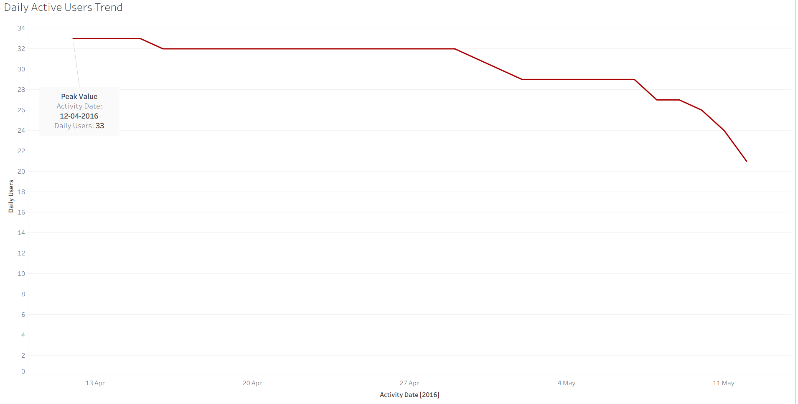
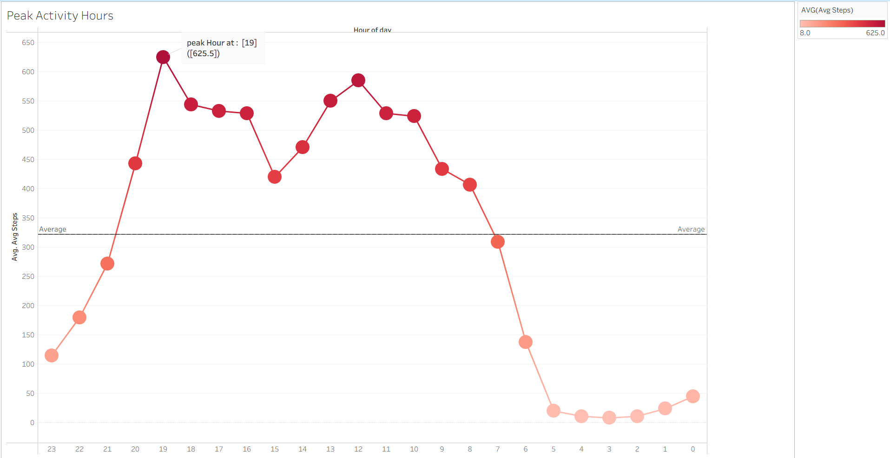
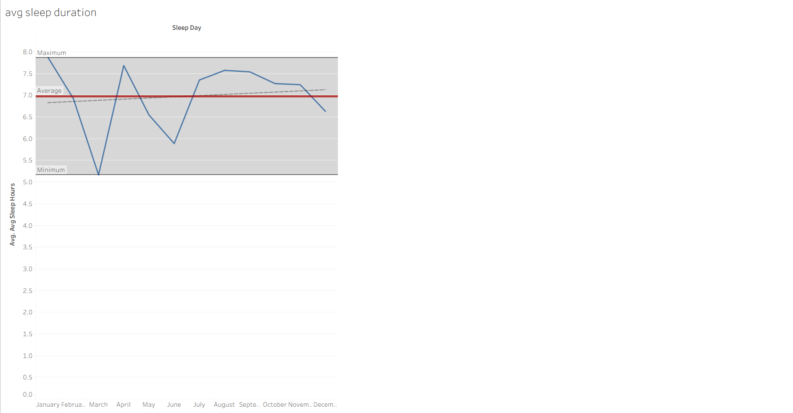
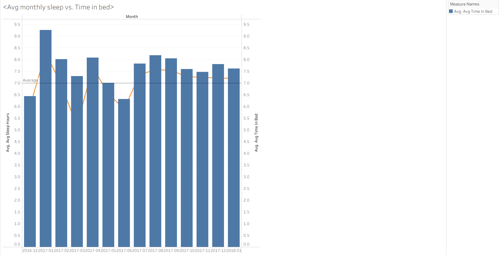
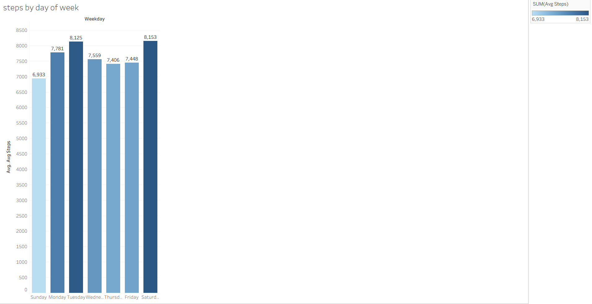

# Bellabeat Case Study- FitBit Smart Device Data Analysis

## Overview
Bellabeat, a health focused company wants to focus on one product and analyze to gain insight into how customers are using their app. This Analysis helps to find the activity and sleep patterns and to identify oppurtunities for improvement of customner experience and to promote healthier habits among users.

## Dataset
- Used from FitBit fitness Tracker Data available from Kaggle. It contains daily activity and health data from 30 eligible fitbit users who have consented to share their information.
- The dataset spans from March 2016 to May 2016

## Tools Used
- Excel(for Exploration)
- SQL(for Data Cleaning)
- Tableau(for Visualization)

## Key Insights
**Daily Activity Trend**: Users have engaged more rise in mid-April, showing a clear rise in active during that period.
**Peak Activity Hours**: Shows activity throughout the day, where users are low during morning hours and reaches high point in the evening.
**Average Sleep Hours**: Shows average sleep hours changes from day to day where users are averaged with 6-7 hours of sleep which is slightly low for adults.
**Monthlty Sleep patterns**: On average, users spend more time in bed than the actual hours they sleep. This shows that users may not be sleeping wfficiently and could experience restless or interuppted sleep.
**Average Daily Steps by Day of Week**: This shows that users have taken average of  some cghalow steps during sundays and highest on saturdays. suggesting some challenges that motivates daily activity.
## Visuals
Below are some charts created in Tableau:

### Daily Active Users

### Peak Activity Hours

### Average Sleep Duration

### Average Monthly Sleep Patterns

### Average Daily Steps by Day of Week

